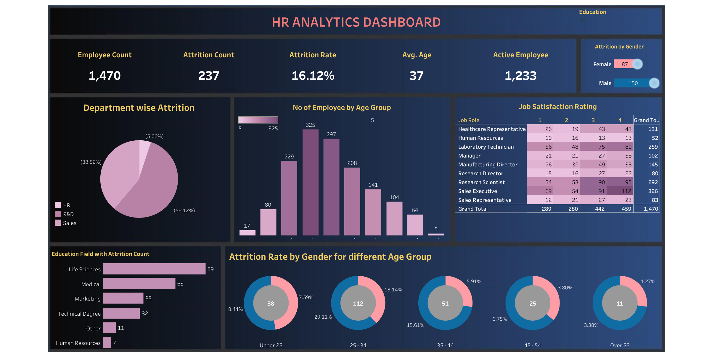

# HR Analytics Dashboard - Tableau

Welcome to the **HR Analytics Dashboard - Tableau** project repository. This project showcases an HR analytics dashboard created using Tableau. The dashboard provides insights into HR-related data and trends.

## Files

- `HR Dashboard.pdf`: This PDF file contains screenshots or a presentation of the HR analytics dashboard created in Tableau.
- `HR Dashboard.png`: An image file representing the HR analytics dashboard.
- `HR Data.pptx`: A presentation or documentation about the HR data used in the dashboard.
- `HR Data.twbx`: The Tableau workbook file containing the visualizations and dashboard.
- `HR Data.xlsx`: The dataset or data used for creating the HR analytics dashboard.

## Getting Started

1. Clone or download this repository to your local machine.
2. Open the `HR Data.twbx` Tableau workbook file using Tableau Desktop or Tableau Reader.
3. Explore the visualizations and the dashboard to gain insights into HR-related data and trends.

## Screenshots

## Project Highlights

- **HR Insights**: The Tableau dashboard visualizes and presents HR-related insights, such as employee demographics, attrition rates, performance metrics, etc.
- **Interactive Visualizations**: The dashboard allows users to interact with the visualizations, apply filters, and explore data on-demand.
- **Data Source**: The project may use the `HR Data.xlsx` dataset as the source for generating visualizations.
 
## Contributing

Contributions are welcome! If you have suggestions for improvements, want to add more visualizations, or enhance the dashboard's interactivity, feel free to open an issue or submit a pull request.

## Contact
For questions or inquiries, you can reach out to [Toyaj Yadav] at [Trjob955@gmail.com](mailto:trjob955@gmail.com).
